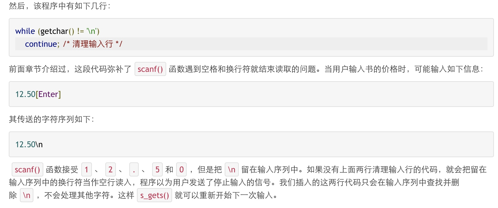

# 使用说明

项目使用 `Xcode 10.x` 构建的, clone 下来即可在 `Xcode` 中直接运行.

# 重点内容摘要

## ch14 结构体、联合

#### manybook.c 中：



#### 结构中的字符数组和字符指针：  
在结构中，字符数组使用较简单。  
而结构中的字符指针要用 malloc 开辟空间，并且使用完后要调用 free 释放空间。示例请看：https://github.com/Huang-Libo/C-Primer-Plus-6e/blob/master/raw_source_code/Ch14/names3.c    

#### 联合

联合（union）是一种数据类型，它能在同一个内存空间中储存不同的数据类型（不是同时储存）。  


#### typedef 与 #define 的区别：  
- 与#define不同，typedef创建的符号名只受限于类型，不能用于值。
- typedef由编译器解释，不是预处理器。
- 在其受限范围内，typedef比#define更灵活。

```
typedef char * STRING; //编译器将把STRING识别为一个指向char的指针变量。
STRING name, sign;
// 上面声明相当于：
char * name, * sign;
```

```
#define STRING char *
STRING name, sign;
// 上面声明相当于：
char * name, sign; //（这导致只有name才是指针，这很可能不是我们想要的结果）
```


# 常用资料

## C 运算符优先级

来源：https://zh.cppreference.com/w/c/language/operator_precedence  

  


